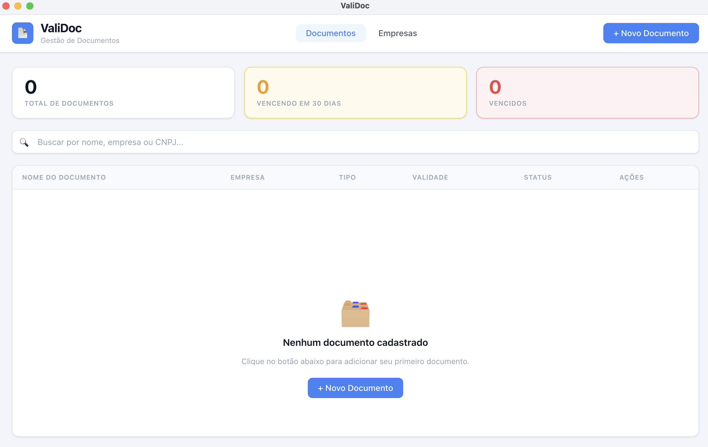

# ValiDoc

A desktop application for managing documents with expiration dates, linked to companies. Built with Electron and SQLite — no internet connection required.



## Features

- **Document tracking** — store documents with expiration dates and get notified before they expire
- **Document types** — manage a reusable list of document types (certidões, alvarás, etc.)
- **Company management** — link documents to companies with contact info (CNPJ, phone, email)
- **File attachments** — attach any file to a document; open or save a copy at any time
- **Status indicators** — see at a glance which documents are valid, expiring soon, or already expired
- **System tray** — runs quietly in the background with daily expiration checks
- **Auto-update** — receives new versions automatically via GitHub Releases

## Installation

Download the latest installer for your platform from the [Releases](https://github.com/arthurgmr/validoc/releases) page.

| Platform | File |
|----------|------|
| Windows  | `ValiDoc-Setup-x.x.x.exe` |
| macOS    | `ValiDoc-x.x.x.dmg` |

## Tech Stack

- [Electron](https://www.electronjs.org/)
- [better-sqlite3](https://github.com/WiseLibs/better-sqlite3)
- [electron-builder](https://www.electron.build/)
- [electron-updater](https://www.electron.build/auto-update)
- Vanilla JS (ES Modules, no UI framework)

## Development

```bash
# Install dependencies
npm install

# Rebuild native modules
npm run rebuild

# Start in development mode
npm run start:dev
```

## Building

```bash
# Windows
npm run build:win

# macOS
npm run build:mac
```

Releases are built and published automatically via GitHub Actions when a version tag is pushed:

```bash
git tag v1.0.0
git push origin main --tags
```

## License

MIT
